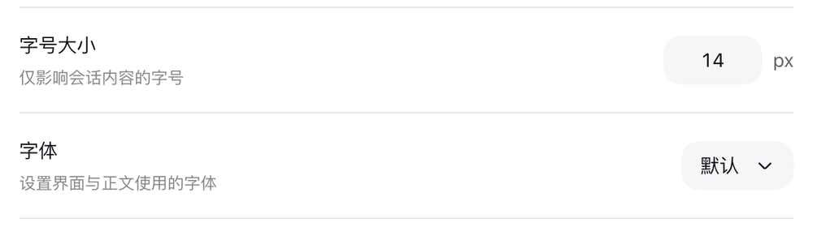
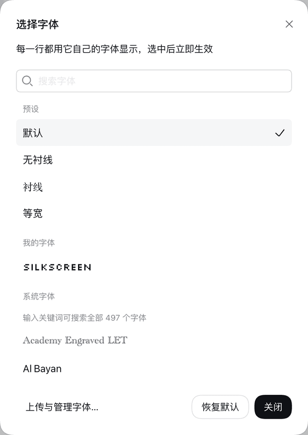

# dsh-plugin-ui-font-family

[](https://github.com/rhczz/dsh-plugin-ui-font-family/actions/workflows/ci.yml)
[](https://github.com/rhczz/dsh-plugin-ui-font-family/releases/latest)

给 DeepSeek Harness 的 Web 界面换字体。设置页里会多出一行「字体」，就排在「字号大小」下面。



可选内置预设、这台机器上装好的字体，也可以上传自己的字体文件。挑字体时每一行都用它自己的字体渲染，选中之前就能看出差别：



## 功能

- **四档内置预设**：默认 / 无衬线 / 衬线 / 等宽。
- **本机字体**：列出这台机器上装好的字体（一台 Mac 通常四五百个），输入关键词就能搜。名字取自字体文件自己声明的族名，所以中文常见的是英文名，比如 `Songti SC`、`Heiti SC`。
- **上传自己的字体**：支持 `.ttf` `.otf` `.woff` `.woff2` `.ttc`，单个最大 20 MB。也可以直接把字体文件拷进字体目录，一样会被认出来。
- **所见即所得**：每一行用它自己的字体显示，选中立刻生效，并记住你的选择。
- **只改正文**：代码块用的等宽字体有意不动，换成非等宽字体会把代码排版弄坏。
- 中文、英文界面都跟得上。

## 安装

先要有一个能跑的 DeepSeek Harness（`dsh` 命令可用）。把下面的 `web` 换成你实际用的 profile 名即可。

### 从 npm 装（推荐）

```sh
dsh plugin --profile web add dsh-plugin-ui-font-family
```

一条命令，装的是发布时构建好的产物：不在你机器上执行任何构建脚本，不需要 `allowBuilds`。想固定版本就带上版本号：

```sh
dsh plugin --profile web add dsh-plugin-ui-font-family@0.3.0
```

### 从 GitHub 装

npm 上只有发布过的版本；要跟主分支最新代码用这条：

```sh
dsh plugin --profile web add github:rhczz/dsh-plugin-ui-font-family
```

想钉住某个 commit：

```sh
dsh plugin --profile web add github:rhczz/dsh-plugin-ui-font-family#<commit>
```

这种方式会在**安装时**在你机器上构建一次插件（几十秒）。pnpm 默认拦住这类构建脚本，所以第一次会失败，并把该写的那行配置原样打印出来——照着加进 `$DSH_HOME/profiles/web/pnpm-workspace.yaml`，再跑一遍同样的命令即可：

```yaml
allowBuilds:
  'dsh-plugin-ui-font-family@git+https://github.com/rhczz/dsh-plugin-ui-font-family.git#<commit>': true
```

这条配置等于**允许该仓库在你机器上执行代码**。所以要钉 commit，并且只装你看得懂源码的插件。

装完重启 `dsh web`。

### 从 tgz 装（从发布页直接下）

```sh
dsh plugin --profile web add https://github.com/rhczz/dsh-plugin-ui-font-family/releases/download/v0.3.0/dsh-plugin-ui-font-family-0.3.0.tgz
```

这条不需要 `allowBuilds`，也不需要在本地编译。换成别的版本号就能装别的版本，或者去[发布页](https://github.com/rhczz/dsh-plugin-ui-font-family/releases)挑一个。已经下载到本地的话：

```sh
dsh plugin --profile web add ./dsh-plugin-ui-font-family-0.3.0.tgz
```

### 从源码目录装（自己改代码时用）

```sh
git clone https://github.com/rhczz/dsh-plugin-ui-font-family.git
cd dsh-plugin-ui-font-family && pnpm install && pnpm build
dsh plugin --profile web add "$PWD"
```

装的是软链，改完源码重新 `pnpm build` 就生效。

### 装完之后

重启 `dsh web`，打开「设置 → 通用设置」，「字体」那一行就在「字号大小」下面。不需要手改 profile 里的任何文件——插件自带 bundle 覆盖层，`dsh plugin add` 会把这一行自动接进条目列表。

本插件对着 dsh `0.1.6-alpha.1` 这条版本线开发。dsh 版本跨度较大时可能需要跟着更新。

版本号还在 `0.x`：接口和配置项都可能在小版本里改，升级前看一眼 [Releases](https://github.com/rhczz/dsh-plugin-ui-font-family/releases) 的说明。

## 配置

一般不用配。要改的话写进 profile 自己的 `$DSH_HOME/profiles/web/cordis.patch.yml`：

```yaml
- id: ui-font-family
  config:
    # 这个部署的默认字体；用户没选过时用它，用户点「恢复默认」也回到它
    defaultFamily:
      source: preset
      id: serif
```

| 字段 | 默认值 | 说明 |
|---|---|---|
| `fontDir` | `$DSH_HOME/fonts` | 上传字体的存放目录 |
| `systemFontDirs` | `[]` | 额外扫描的字体目录，排在平台默认目录之后 |
| `scanSystemFonts` | `true` | 设为 `false` 就不再扫描系统字体目录（`systemFontDirs` 里写明的目录不受影响） |
| `maxUploadBytes` | `20971520`（20 MiB） | 单个上传文件的大小上限 |
| `defaultFamily` | `{ source: preset, id: default }` | 这个部署的默认字体 |
| `dshHome` | `$DSH_HOME`，再退回 `~/.dsh` | 覆盖 harness home 的判定 |

`defaultFamily` 的 `source` 取 `preset` / `system` / `upload`，`id` 分别是预设名、字体族名、上传后的文件名。用户自己的选择永远压在它上面。

`maxUploadBytes` 写了非整数、或 `defaultFamily` 指向不存在的预设，dsh 会在**启动时**直接报错，而不是等到用的时候才出问题。

## 上传的字体存在哪

**`$DSH_HOME/fonts/`**，默认就是 `~/.dsh/fonts/`，和 `settings.yaml` 放在一起。在「字体管理」对话框里能看到当前的实际路径。

- 跟着 harness home 走：备份、迁移、换机器只要搬这一个目录。
- 浏览器可能不在同一台机器上，所以字体由 dsh 自己提供，而不是只存在浏览器里。
- 可以直接把字体文件 `cp` 进这个目录，不用经过设置页——一样会被识别出来。

上传的文件会被重命名成 `<族名>-<8 位随机>.<扩展名>`，扩展名按文件内容判断，不看上传时的文件名；写入先落临时文件再改名，中途失败不会留下半个文件。目录里读不出字体族的文件会被跳过，其余字体照常可用。

**上传和删除接口没有单独的鉴权**，它假设你已经用 dsh 自己的 token 或反向代理把整个界面保护起来了。系统字体清单只发给同一台机器上的浏览器，远程访问时不会返回。

## 已知限制

- **只影响界面正文**。代码块的等宽字体是有意不动的。
- **上传的字体在第一帧可能有极短跳变**，因为字形要等浏览器加载完 @font-face。
- **字体清单是每次加载页面时的一份快照**。在另一个浏览器里删掉某个字体，当前页面不会自己发现，刷新即可。本页面上传或删除后会立刻重新读取。
- **同名族会并列出现**：手动拷进去一份、又上传了同名的一份，列表里就是两行，删掉其中一个另一个仍在。
- **`source: system` 不做存在性校验**：字体装在哪台机器、哪台在跑浏览器，插件无从判断，所以照写，由浏览器回退到字体栈里的后备字体。

## 卸载

```sh
dsh plugin --profile web remove dsh-plugin-ui-font-family
```

设置页里的那一行会随之消失。**`$DSH_HOME/fonts/` 里的字体文件不会被删除**，想清掉就自己删目录。

## 开发

本仓库同时是插件的源码仓库。构建、测试、内部设计约束和踩过的坑见 [DEVELOPING.md](DEVELOPING.md)。

## 许可证

MIT。`tests/fixtures/` 下的 Silkscreen 字体为 SIL Open Font License 1.1，许可证正文见 `tests/fixtures/OFL.txt`。

## 为什么个别字体「字高图标低」

个别字体会让文字看着比图标高：阿拉伯语系字体（如 Al Nile）要在基线下给变音符号留位置，把基线顶高了。这是浏览器按字体自身度量排版的结果，不是插件的问题，换别的字体即可避免。

想追究到底的话，见 [DEVELOPING.md](DEVELOPING.md) 的「已知限制」——那里有行高、ascent/descent 和基线位置的实测数据。
